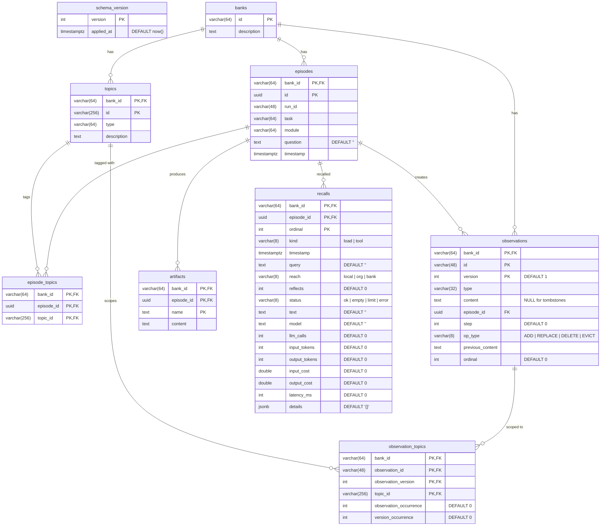

[← Back to README](../README.md#documentation)

# Hippocampus Memory System

## Overview

Episode-based memory that wraps DSPy agents with persistent context across reviews.
Agents accumulate knowledge about a codebase scope over time — patterns, constants,
parsing schemas — and reuse it in subsequent reviews of the same code area.

## Concepts

### Banks

A bank is the top-level data partition. All episodes, topics, observations,
artifacts and recalls cascade-delete from a bank.

- Configured via `MEMORY_BANK_ID` (default: `codespy`)
- Typical values: service name, team name, org identifier
- Changing the bank ID starts a fresh memory silo — no data carries over

### Topics

- Every scope gets a `topic_id` derived from `make_topic_id(repo_slug, subroot)`
- Topics organize memory by code area so knowledge doesn't bleed between scopes
- `compute_common_ancestor_topic_id()` finds shared parent for cross-scope queries

### Episodes

- An Episode captures one agent's run: task, context_memory, mutations, artifacts, recalls, timestamp
- Stored in PostgreSQL (auto-created tables). pg0-embedded auto-starts
  a local instance when no `MEMORY_POSTGRES_HOST` is set.
- `EpisodeStore.load_context(task, topic_ids, topic_prefix)` retrieves
  the latest context by `timestamp DESC`, filtering on bank + task + topic

### Context Memory

Six sections (from general to specific):

1. **`context_roadmap`** — Index of what the context contains and where to find it
2. **`context_understanding`** — High-level understanding of the context
3. **`domain_constants`** — Exact parameters, formulas, thresholds, reference values, enum sets
4. **`actions`** — Tool execution patterns: what tool was used, for what purpose, and the result
5. **`parsing_schema`** — How to parse the context's format: delimiters, boundary patterns, field structure
6. **`reusable_results`** — Agent-derived aggregated outputs (counts, distributions, classifications) reusable across questions

Each section contains `Observation` objects with `id`, `content`, and `topic_ids` linking
the observation to its relevant scopes.

### Observations

Observations are the versioned audit trail of context memory items in the database.
Each time the Cartographer ADDs, REPLACEs, or DELETEs an observation, or eviction drops
one, a new observation row is inserted with an incremented `version` number.

- `content` holds the new value (`NULL` for the DELETE and EVICT tombstones)
- `previous_content` preserves the prior state (for REPLACE / DELETE / EVICT)
- `op_type` records the operation: `ADD`, `REPLACE`, `DELETE` or `EVICT`
- Linked to the episode that produced the mutation and the topics it belongs to

Observations in `ContextMemory` map 1:1 to the latest observation version that is not a
tombstone.

### Artifacts

Named text outputs attached to an episode — for example, the final review
markdown or the PR summary text. Stored as `(episode_id, name) → content`.

### Recalls

One row per Prefrontal recall made during the agent call: the pre-call load
(`kind = load`) and each `recall_memory` tool call (`kind = tool`). A row holds the exact
text the agent received, plus the query, reach, status, model, LLM calls, input/output
tokens and cost, and latency. Recalls are for monitoring only: they are never given to the
Distiller or the Cartographer and never retained into Cerebral. See
[Monitoring recalls](#monitoring-recalls).

## Database Schema

Auto-created by `EpisodeStore.ensure_schema()` on first connect.
Source: `EpisodeStore.ensure_schema()` in `src/codespy/agents/memory/postgres.py`.

### Entity Relationship Diagram


```mermaid
erDiagram
    schema_version {
        int version PK
        timestamptz applied_at "DEFAULT now()"
    }

    banks {
        varchar(64) id PK
        text description
    }

    topics {
        varchar(64) bank_id PK, FK
        varchar(256) id PK
        varchar(64) type
        text description
    }

    episodes {
        varchar(64) bank_id PK, FK
        uuid id PK
        varchar(48) run_id
        varchar(64) task
        varchar(64) module
        text question "DEFAULT ''"
        timestamptz timestamp
    }

    episode_topics {
        varchar(64) bank_id PK, FK
        uuid episode_id PK, FK
        varchar(256) topic_id PK, FK
    }

    observations {
        varchar(64) bank_id PK, FK
        varchar(48) id PK
        int version PK "DEFAULT 1"
        varchar(32) type
        text content "NULL for tombstones"
        uuid episode_id FK
        int step "DEFAULT 0"
        varchar(8) op_type "ADD | REPLACE | DELETE | EVICT"
        text previous_content
        int ordinal "DEFAULT 0"
    }

    observation_topics {
        varchar(64) bank_id PK, FK
        varchar(48) observation_id PK, FK
        int observation_version PK, FK
        varchar(256) topic_id PK, FK
        int observation_occurrence "DEFAULT 0"
        int version_occurrence "DEFAULT 0"
    }

    artifacts {
        varchar(64) bank_id PK, FK
        uuid episode_id PK, FK
        text name PK
        text content
    }

    recalls {
        varchar(64) bank_id PK, FK
        uuid episode_id PK, FK
        int ordinal PK
        varchar(8) kind "load | tool"
        timestamptz timestamp
        text query "DEFAULT ''"
        varchar(8) reach "local | org | bank"
        int reflects "DEFAULT 0"
        varchar(8) status "ok | empty | limit | error"
        text text "DEFAULT ''"
        text model "DEFAULT ''"
        int llm_calls "DEFAULT 0"
        int input_tokens "DEFAULT 0"
        int output_tokens "DEFAULT 0"
        double input_cost "DEFAULT 0"
        double output_cost "DEFAULT 0"
        int latency_ms "DEFAULT 0"
        jsonb details "DEFAULT '{}'"
    }

    banks ||--o{ topics : "has"
    banks ||--o{ episodes : "has"
    banks ||--o{ observations : "has"
    episodes ||--o{ episode_topics : "tagged with"
    topics ||--o{ episode_topics : "tags"
    episodes ||--o{ observations : "creates"
    episodes ||--o{ artifacts : "produces"
    episodes ||--o{ recalls : "recalled"
    observations ||--o{ observation_topics : "scoped to"
    topics ||--o{ observation_topics : "scopes"
```

### Indexes

| Index | Table | Definition |
|-------|-------|------------|
| `idx_topics_id_trgm` | topics | `GIN (id gin_trgm_ops)` — trigram fuzzy search |
| `idx_episodes_task_time` | episodes | `(bank_id, task, timestamp DESC)` |
| `idx_episode_topics_reverse` | episode_topics | `(bank_id, topic_id)` |
| `idx_observations_episode` | observations | `(bank_id, episode_id)` |
| `idx_observation_topics_reverse` | observation_topics | `(bank_id, topic_id)` |
| `idx_recalls_time` | recalls | `(bank_id, timestamp DESC)` |

### Notes

- All tables cascade-delete from `banks`
- `observations` is versioned: PK `(bank_id, id, version)` tracks ADD/REPLACE/DELETE/EVICT history per observation
- `episode_topics` and `observation_topics` are M:N junction tables
- `observation_topics.observation_occurrence` counts cumulative topic associations across all versions; `version_occurrence` counts within one version
- `recalls` is episodic-only (never retained into Cerebral); PK `(bank_id, episode_id, ordinal)` makes saves idempotent
- Requires PostgreSQL extension: `pg_trgm`

## Reflection Pipeline

After each agent run (at `end_episode()`):

1. **Distiller** — Analyzes the agent's trajectory (head 60% + tail 40%, capped at `max_trajectory_tokens`) and proposes `CacheCandidate` observations for context memory
2. **Cartographer** — Takes candidates + current context memory, decides operations:
   - `ADD` — Insert new observation
   - `REPLACE` — Update existing observation with new knowledge
   - `DELETE` — Remove outdated/irrelevant observation
3. **Eviction** — If memory exceeds `max_hippocampus_tokens`, oldest general observations are evicted first

The Distiller also tags each existing context memory observation with an `ObservationTag`:

- **`helpful`** — directly aided the agent; keep
- **`harmful`** — misled the agent or contradicted observations; remove
- **`neutral`** — present but unused this round; keep
- **`stale`** — no longer reflects the external context; remove

These tags inform the Cartographer's edit decisions.

## Semantic Memory: Cerebral and Prefrontal

Three components, fully independent:

| Component | Role | Reads | Writes |
|-----------|------|-------|--------|
| **Hippocampus** | Learns from the current episode. Reloads prior episodes (`load_context` → `initial_memory`) only so it does not relearn existing facts. | episodic store | episodic store |
| **Cerebral** | Retains Hippocampus episodes into the Hindsight bank, consolidates them into observations and keeps the mental models (briefings) fresh. | — | Hindsight bank |
| **Prefrontal** | Gives the agent useful prior knowledge so it does not rediscover it. | Hindsight bank | nothing |

The reloaded Hippocampus episode is **never** passed to the agent, and
`prefrontal_memory` is never given to the Distiller or the Cartographer.
Prefrontal and Hippocampus never feed each other.

### Data flow

```
agent call ──► Prefrontal.aload() / recall_memory ──reads──► Cerebral (Hindsight bank)
    │              │ prefrontal_memory (read-only input) + recall_memory tool
    │              └──► RecallRecord[] ──► Episode.recalls ──► episodic store (recalls table)
    ▼
trajectory ──► Hippocampus (Distiller → Cartographer) ──► episodic store
                                   └──► Cerebral.retain_episode()  (background save thread; recalls excluded)
                                          ├─ retain_batch_async (fact extraction)
                                          ├─ consolidation (inline, SyncTaskBackend)
                                          └─ mental-model upkeep
```

### Tags and observation scopes

Every retained item carries its topic tags (`project_scope:<id>`, `pull_request:<url>`),
`episode:`, `task:`, `run_id:`, and — new — `repo:<owner/repo>` and `org:<owner>`.

Consolidation uses an explicit `observation_scopes` list: one
`[org:, repo:, project_scope:]` scope per `project_scope` topic of the episode, or
`[org:, repo:]` when there is none. `task:`, `episode:`, `run_id:` and
`pull_request:` never enter a scope, so facts about the same scope merge across tasks
and runs, and a correction made by one task reaches all of them. Task relevance is
handled at read time (the task-specific query ranks; raw facts keep their `task:` label).

Cerebral runs Hindsight with `SyncTaskBackend`: consolidation and mental-model refreshes
run inline inside `retain_episode`, on the background save thread. (Previously
`BrokerTaskBackend` only queued them for a worker codespy never started, so they never ran.)
The first retain after upgrading consolidates the whole backlog, which is slow and costs
LLM tokens; Cerebral logs when consolidation starts and ends. The process waits for
background saves (retain + consolidation) to complete before exiting.

Old data has no `repo:`/`org:` tags and per-episode observations. It stays reachable
through `project_scope:` tags; briefings cover only new data. There is no backfill and
no automatic drop.

### Mental models (briefings)

Mental models are the abstraction layer ("when X happens, consider Y because Z").
Cerebral keeps one per observation scope of each episode, plus one per repo
(`[org:, repo:]`), when `memory.prefrontal.reflects > 0` (briefings enabled):

- id: `mm-` + first 32 hex chars of `sha1("|".join(sorted(tags)))`
- name: `Briefing: <project_scope id | repo>`
- source query: *"What should an agent starting work here know so it does not rediscover it: structure and where things live, conventions, invariants and constants, dependencies and integrations, pitfalls and recurring problems, facts shown to be wrong."*
- `max_tokens = max_mental_model_tokens`, trigger `refresh_after_consolidation`

A missing model is created and refreshed once; consolidation keeps it fresh afterwards.
Prefrontal reads the briefings of the agent's scopes (and repo) with no LLM call;
missing models and models still holding the placeholder content are skipped.

### Reach

`memory.prefrontal.prefrontal_reach` (`local` | `org` | `bank`, default `org`):

- **Local pool** (always): `project_scope:<scope id>` for code_review, doc and
  supply_chain; `repo:<owner/repo>` for scope, summary and audit (summary and audit
  also OR in their scopes' `project_scope:` ids).
- **Remote pool** (`org`: `org:<owner>` AND NOT `repo:<own>`; `bank`: NOT `repo:<own>`):
  always raw facts, labelled with their source repo. It takes a fixed 25% share
  of `max_prefrontal_tokens` (and of `max_prefrontal_tool_tokens` for the tool);
  the local facets split the rest. With `local` reach the local pool gets the
  whole budget. `bank` crosses organisations — opt-in only.

### Pre-call context

Before each call, the agent gets a read-only `prefrontal_memory` input:

1. **Briefings** — one block per mental model.
2. **Five facets** — the semantic layer, which answers the messier questions a briefing
   cannot. They always run, even when briefings exist:

   | Facet | Question | `fact_type` | Share |
   |-------|----------|-------------|-------|
   | `context` | What happened around this work? | experience, world | 30% |
   | `seen_before` | Have we met this file, symbol, package or problem before? | world, observation | 20% |
   | `decisions` | What was decided about it? | world, observation | 20% |
   | `patterns` | What keeps recurring? | observation | 20% |
   | `belief_changes` | What did we believe before, and what changed? | (history) | 10% |

   Facets 1–4 run concurrently (`question_date=now`). `belief_changes` reads the history
   of the top 3 observations of facets 2–4 (2 entries each) and collects
   `RETRACTED` / `supersedes:` facts — no recall, no embedding. Facts are deduplicated
   across sections by id, then by exact text.
3. **Other repositories** — remote facts, "verify before relying on it".

Empty sections are omitted; with nothing at all the input is `""`. The field tells the
agent the content may be stale or wrong and that issues must be verified with tools.

### `reflects`

`memory.prefrontal.reflects` (env `MEMORY_PREFRONTAL_REFLECTS`, default `3`):

- `0`: raw facts only — no LLM at read time, no briefings. The recall_memory tool is
  also disabled.
- `N > 0`: both Prefrontal and briefing refreshes run at Hindsight's LOW budget with
  a doubled global cap (2 × N), so each gets exactly N iterations. The LOW budget
  uses a 0.5× multiplier, so max(1, int(2N × 0.5)) = N iterations.

**Environment override**: if `HINDSIGHT_API_REFLECT_MAX_ITERATIONS` is set, it is used
as-is (not doubled). Both Prefrontal and briefing refreshes then get half of that
value (with LOW budget).

**Reflect LLM timeout/retries**: reuse codespy's `llm.timeout` / `llm.retries`. Override
via `HINDSIGHT_API_REFLECT_LLM_TIMEOUT` / `HINDSIGHT_API_REFLECT_LLM_MAX_RETRIES` (or
the generic `HINDSIGHT_API_LLM_TIMEOUT` / `HINDSIGHT_API_LLM_MAX_RETRIES`).

**Monitoring**: the load INFO line includes `maps=N` (split synthesis map-call count),
`rewrite` (if a rewrite occurred), `thoughts=N` (reasoning tokens), and `tools=...`
(per-tool token sizes). A WARNING is logged when `maps > 0` (split synthesis detected)
or when LLM calls exceed `reflects + 1` (unexpected split synthesis or rewrite).

### `recall_memory` tool

The RLM agents (code_review, scope, supply_chain) get
`async recall_memory(query: str, reach: str = "local") -> str` for follow-up questions.
A reach above the configured one is clamped; at most `max_prefrontal_tool_calls`
calls per agent call (then `"recall limit reached"`); errors return `"memory unavailable"`.

### Model

`memory.prefrontal.model` (env `MEMORY_PREFRONTAL_MODEL`, Action input
`memory-prefrontal-model`) is the model Hindsight's reflect loop uses. It falls back to
`memory.cerebral.retain.model`, then `llm.default_model`. It is passed to `MemoryEngine`
as its reflect LLM, so it **also refreshes the mental models (briefings)**. It is unused
when `reflects = 0`, and it is checked at startup only when `reflects > 0`. Retain and
consolidation keep using the retain model.

### Monitoring recalls

Every recall is logged and stored.

- **Logs** — one INFO line per recall, without the recalled text:
  ```
  Prefrontal[code_review]: load status=ok 1 briefings, facets context=1 seen_before=3 ... model=openai/gpt-4o-mini calls=3 in=5120 out=410 cost=$0.0042 latency=6400ms
  Prefrontal[code_review]: recall_memory reach=local status=ok mode=reflect model=openai/gpt-4o-mini calls=2 in=2210 out=180 cost=$0.0017 latency=3100ms query='where is session refresh'
  ```
- **Episodic store** — one `recalls` row per recall, attached to the agent's episode.
  `text` is exactly what the agent received. `status` is `ok`, `empty`, `limit` (tool cap
  reached) or `error`, so an empty load and a failed load can be told apart. `details`
  holds per-facet queries, counts and failures for loads, and requested reach, mode and
  fact counts for tool calls.
- **Usage** — measured, not estimated: `input_tokens` counts LLM prompt tokens plus query
  embeddings, `output_tokens` counts completions, and costs use `litellm.cost_per_token`
  (0 for unpriced models). With `reflects = 0`, only embedding tokens are recorded.
- **Cost report** — Prefrontal reads are billed to the `memory_prefrontal` bucket.
  Mental-model refreshes during retain stay in `memory_other`.
- Recalls are **not** retained into Cerebral and are never shown to the Distiller or the
  Cartographer. When the episodic store is unavailable, recalls are only logged.

```sql
SELECT e.task, e.run_id, r.kind, r.status, r.model, r.llm_calls,
       r.input_tokens, r.output_tokens, r.input_cost + r.output_cost AS cost,
       r.latency_ms, r.query, r.text
FROM recalls r JOIN episodes e ON e.bank_id = r.bank_id AND e.id = r.episode_id
ORDER BY r.timestamp DESC LIMIT 50;
```

### Gating and failure

Prefrontal is active for a signature only when its memory is enabled and Cerebral is
available; otherwise the agent behaves exactly as before. Every failure in Prefrontal or
in mental-model upkeep logs a warning and degrades to less context, or to `""`.

### Cost and latency

Every retain now runs consolidation and refreshes the touched scopes' models (several LLM
calls per episode, in the `memory_other` cost bucket). `reflects > 0` adds a nested loop to
every agent call and tool call; those Prefrontal reads are billed to `memory_prefrontal`.
Background saves take longer, and process exit waits on them.

## Token Budgets

| Budget | Env Var | Default | Purpose |
|--------|---------|---------|---------|
| Context memory | `MEMORY_MAX_HIPPOCAMPUS_TOKENS` | 16384 | Ceiling on persisted ContextMemory (re-sent every iteration) |
| Observation | `MEMORY_MAX_HIPPOCAMPUS_ITEM_TOKENS` | 512 | Soft per-observation token limit (expressed to LLM, not truncated) |
| Trajectory | `MEMORY_MAX_TRAJECTORY_TOKENS` | 16384 | Head+tail cap on trajectory fed to Distiller |
| Question | `MEMORY_MAX_QUESTION_TOKENS` | 8192 | Cap on serialized inputs as reflection question |
| Compact trajectory | `MEMORY_COMPACT_TRAJECTORY` | `true` | Apply head+tail trajectory bounding before distillation |

Observation capacity ≈ max_hippocampus_tokens / max_hippocampus_item_tokens (16384/512 = 32 observations)

## Configuration

### Global Settings

| Env Var | YAML Path | Default | Description |
|---------|-----------|---------|-------------|
| `MEMORY_POSTGRES_HOST` | `memory.postgres.host` | — | External PostgreSQL host |
| `MEMORY_POSTGRES_PORT` | `memory.postgres.port` | `5432` | External PostgreSQL port |
| `MEMORY_POSTGRES_USER` | `memory.postgres.user` | `postgres` | External PostgreSQL user |
| `MEMORY_POSTGRES_PASSWORD` | `memory.postgres.password` | — | External PostgreSQL password |
| `MEMORY_POSTGRES_DATABASE` | `memory.postgres.database` | `codespy` | External PostgreSQL database |
| `MEMORY_POSTGRES_SCHEMA` | `memory.postgres.schema` | `episodic` | PostgreSQL schema (search_path per memory type) |
| `MEMORY_PG0_NAME` | `memory.pg0.name` | `codespy` | pg0-embedded database name |
| `MEMORY_PG0_PORT` | `memory.pg0.port` | auto | pg0-embedded port |
| `MEMORY_PG0_DATA_DIR` | `memory.pg0.data_dir` | — | Custom data directory for pg0-embedded |
| `MEMORY_BANK_ID` | `memory.bank_id` | `codespy` | Scopes all memory data |
| `MEMORY_ENABLED` | `memory.enabled` | `false` | Enable memory globally (episodic + semantic) |
| `MEMORY_COMPACT_TRAJECTORY` | `memory.hippocampus.compact_trajectory` | `true` | Apply head+tail trajectory bounding before distillation |

### Prefrontal Settings

| Env Var | YAML Path | Default | Description |
|---------|-----------|---------|-------------|
| `MEMORY_PREFRONTAL_MODEL` | `memory.prefrontal.model` | `memory.cerebral.retain.model` → `llm.default_model` | Reflect loop + mental-model refresh; unused when reflects=0 |
| `MEMORY_PREFRONTAL_REACH` | `memory.prefrontal.prefrontal_reach` | `org` | `local`, `org` or `bank` |
| `MEMORY_PREFRONTAL_REFLECTS` | `memory.prefrontal.reflects` | `3` | Reflect iterations; `0` = raw facts, no LLM, no briefings |
| `MEMORY_MAX_MENTAL_MODEL_TOKENS` | `memory.prefrontal.max_mental_model_tokens` | `2048` | Briefing size |
| `MEMORY_MAX_PREFRONTAL_TOKENS` | `memory.prefrontal.max_prefrontal_tokens` | `8192` | Pre-call context budget |
| `MEMORY_MAX_PREFRONTAL_TOOL_TOKENS` | `memory.prefrontal.max_prefrontal_tool_tokens` | `2048` | Tool result budget |
| `MEMORY_MAX_PREFRONTAL_TOOL_CALLS` | `memory.prefrontal.max_prefrontal_tool_calls` | `0` | Tool calls per agent call (0 = tool off) |

### Reflection Module LLM Overrides

| Module | Env Var Pattern | YAML Path |
|--------|----------------|-----------|
| Distiller | `MEMORY_DISTILLER_{MODEL,REASONING_EFFORT,TEMPERATURE,MAX_TOKENS,MAX_ITERS,MAX_LLM_CALLS}` | `memory.hippocampus.distiller.*` |
| Cartographer | `MEMORY_CARTOGRAPHER_{MODEL,REASONING_EFFORT,TEMPERATURE,MAX_TOKENS,MAX_ITERS,MAX_LLM_CALLS}` | `memory.hippocampus.cartographer.*` |

### Per-Signature Memory Overrides

Each signature's `memory:` block in YAML (or `REVIEW_<SIGNATURE>_MEMORY_*` env vars):

| Setting | Env Var Suffix | Description |
|---------|---------------|-------------|
| enabled | `_MEMORY_ENABLED` | Enable/disable memory for this signature |

Example: `REVIEW_CODE_REVIEW_MEMORY_ENABLED=true`

See [Configuration](configuration.md#recommended-model-strategy) for recommended reflection models.

## Quick Start

Enable memory for code review:
```bash
MEMORY_ENABLED=true
# Or per-signature:
REVIEW_CODE_REVIEW_MEMORY_ENABLED=true
REVIEW_SUMMARY_MEMORY_ENABLED=true
```

Recommended mid-tier reflection model:
```bash
MEMORY_DISTILLER_MODEL=anthropic/claude-sonnet-4-5-20250929
MEMORY_CARTOGRAPHER_MODEL=anthropic/claude-sonnet-4-5-20250929
```

> **Note:** pg0-embedded auto-starts when installed (default for local dev).
> For production, set `MEMORY_POSTGRES_HOST`:
> ```
> MEMORY_POSTGRES_HOST=rds-host.amazonaws.com
> MEMORY_POSTGRES_USER=myuser
> MEMORY_POSTGRES_PASSWORD=mypassword
> ```

### GitHub Action

```yaml
- name: Run CodeSpy Review
  uses: khezen/codespy@v1
  with:
    model: 'anthropic/claude-opus-4-6'
    anthropic-api-key: ${{ secrets.ANTHROPIC_API_KEY }}
    # Memory with external PostgreSQL
    memory-enabled: 'true'
    memory-postgres-host: ${{ secrets.MEMORY_POSTGRES_HOST }}
    memory-postgres-user: ${{ secrets.MEMORY_POSTGRES_USER }}
    memory-postgres-password: ${{ secrets.MEMORY_POSTGRES_PASSWORD }}
    memory-distiller-model: 'anthropic/claude-haiku-4-5-20251001'
    memory-cartographer-model: 'anthropic/claude-haiku-4-5-20251001'
    # memory-retain-model: 'anthropic/claude-sonnet-4-5-20250929'
    # memory-prefrontal-model: 'anthropic/claude-sonnet-4-5-20250929'
```

> **Note:** pg0-embedded is included in the Docker image. For persistent memory
> across CI runs, use an external PostgreSQL instance via `memory-postgres-host`.

---

[← Back to README](../README.md#documentation)
