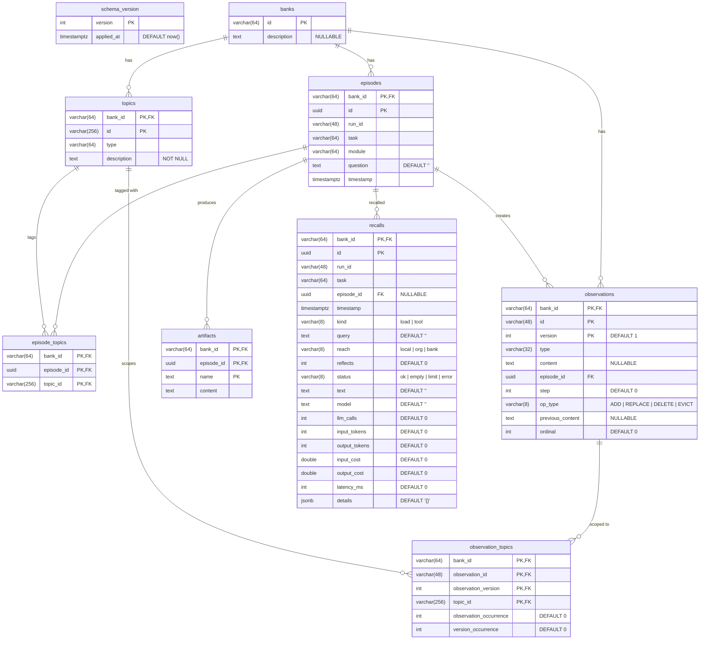

[← Back to README](../README.md#documentation)

# Memory System

CodeSpy's memory system has three independent components:

| Component | Role | Storage | Schema |
|-----------|------|---------|--------|
| **Hippocampus** | Learns from the current episode | PostgreSQL (`episodic`) | Episodic: episodes, observations, recalls |
| **Cerebral** | Retains episodes into semantic memory, consolidates, refreshes mental models | Hindsight bank | Semantic: observations, mental models |
| **Prefrontal** | Reads Cerebral and injects prior knowledge into agents | — | Read-only |

**Terminology note:** The module is "Prefrontal" but its configuration lives under `memory.prefrontal.recall.*` and its cost bucket is `memory_recall`. *Recall* = the read operation Prefrontal performs (config, bucket, table).

## Lifecycle of one review run

```
1. forward() runs the review phase inside defer_episode_saves()
   ├── Scope agent (if memory enabled and model refinement runs)
   │   └── Own Prefrontal load (task="review", include_repo=True)
   ├── Run-level Prefrontal recall (task="review", episode_id=NULL)
   ├── Summary
   ├── code_review, doc, supply_chain (concurrent)
   └── Audit
2. Review published with "Memory: pending" (remote) or printed (local CLI/MCP)
3. finish_memory() starts queued saves
   ├── Each episode: end_episode() → Distiller → Cartographer → evict → save
   └── retain_episode() for each scope
4. join_episode_saves()
5. consolidate_run() → one consolidation over union of touched scopes
6. Hindsight refreshes briefings via refresh_after_consolidation trigger
7. Costs recollected, review edited with full costs (remote) or printed
```

If `forward()` raises, deferred saves still start but consolidation does not run. The at-exit hook finishes pending saves but does **not** call `consolidate_run`.

## Agents and memory

| Agent | Gets pre-call memory from | Has `recall_memory` tool | Writes episode |
|-------|---------------------------|--------------------------|----------------|
| scope | Own load (run-level if no refinement) | Yes | Yes |
| summary | Run-level | No | Yes |
| code_review | Run-level | Yes | Yes |
| doc | Run-level | No | Yes |
| supply_chain | Run-level | Yes | Yes |
| audit | Run-level | No | Yes |

The run-level recall (`task="review"`, `episode_id=NULL`) covers all project scopes plus the repo. Only the scope agent loads its own memory when model refinement runs; all other agents share the run-level recall.

## Hippocampus (episodic)

### Banks

A bank is the top-level data partition. All episodes, topics, observations, artifacts and recalls cascade-delete from a bank.

- Configured via `MEMORY_BANK_ID` (default: `codespy`)
- Typical values: service name, team name, org identifier
- Changing the bank ID starts a fresh memory silo — no data carries over

### Topics

- Every scope gets a `topic_id` derived from `make_topic_id(repo_slug, subroot)`
- Topics organize memory by code area so knowledge doesn't bleed between scopes
- `compute_common_ancestor_topic_id()` finds shared parent for cross-scope queries

### Episodes

An Episode captures one agent's run:

- `id` (UUID): unique episode identifier
- `run_id` (varchar): parent run identifier
- `task` (varchar): agent task name (e.g., "code_review")
- `module` (varchar): module identifier
- `question` (text): the task question
- `context_memory`: six sections of observations
- `mutations`: ADD/REPLACE/DELETE operations produced by Cartographer
- `artifacts`: named outputs (e.g., review markdown)
- `recalls`: Prefrontal loads and tool calls
- `timestamp`: episode timestamp
- `topics`: list of Topic objects for this episode

`EpisodeStore.load_context(task, topic_ids)` merges every live (non-tombstone) observation from **all** prior episodes of the task that match the topics, ordered **oldest first** (`timestamp ASC`) so eviction drops the oldest facts on ties.

### Context Memory sections

Six sections (from general to specific):

1. **`context_roadmap`** — Index of what the context contains and where to find it
2. **`context_understanding`** — High-level understanding of the context
3. **`domain_constants`** — Exact parameters, formulas, thresholds, reference values, enum sets
4. **`actions`** — Tool execution patterns: what tool was used, for what purpose, and the result
5. **`parsing_schema`** — How to parse the context's format: delimiters, boundary patterns, field structure
6. **`reusable_results`** — Agent-derived aggregated outputs (counts, distributions, classifications) reusable across questions

Each section contains `Observation` objects with `id`, `content`, and `topic_ids` linking the observation to its relevant scopes.

### Observations

Observations are the versioned audit trail of context memory items in the database. Each time the Cartographer ADDs, REPLACEs, or DELETEs an observation, or eviction drops one, a new observation row is inserted with an incremented `version` number.

- `content` holds the new value (`NULL` for DELETE and EVICT tombstones)
- `previous_content` preserves the prior state (for REPLACE / DELETE / EVICT)
- `op_type` records the operation: `ADD`, `REPLACE`, `DELETE` or `EVICT`
- Linked to the episode that produced the mutation and the topics it belongs to

Observations in `ContextMemory` map 1:1 to the latest observation version that is not a tombstone.

### Artifacts

Named text outputs attached to an episode — for example, the final review markdown or the PR summary text. Stored as `(episode_id, name) → content`.

### Reflection Pipeline

At `end_episode()` (one pass per episode, after the review is published):

1. **Distiller** — Analyzes the agent's trajectory (head 60% + tail 40% when `compact_trajectory=true`, capped at `max_trajectory_tokens`) and proposes `CacheCandidate` observations
2. **Cartographer** — Takes candidates + current context memory, decides operations: `ADD`, `REPLACE`, `DELETE`
3. **Eviction** — If memory exceeds `max_hippocampus_tokens`, evicts by:
   - Section priority first: `parsing_schema` → `actions` → `reusable_results` → `domain_constants` → `context_roadmap` → `context_understanding`
   - Then by score (helpful +1, harmful/stale −1, new +1)
   - Then by age (oldest first)

The Distiller tags each existing observation:

- **`helpful`** — directly aided the agent; keep
- **`harmful`** — misled the agent or contradicted observations; remove
- **`neutral`** — present but unused this round; keep
- **`stale`** — no longer reflects the external context; remove

These tags inform the Cartographer's edit decisions.

## Cerebral (semantic store)

Cerebral retains Hippocampus episodes into Hindsight semantic memory and keeps mental models (briefings) fresh.

### Tags and observation scopes

Every retained item carries its `project_scope:<id>` topic tags, `task:`, and `repo:<owner/repo>`/`org:<owner>`. `pull_request:`, `episode:`, and `run_id:` tags are no longer added.

Consolidation uses an explicit `observation_scopes` list: one `[org:, repo:, project_scope:]` scope per `project_scope` topic of the episode, or `[org:, repo:, project_scope:<owner/repo>]` (the repo-root scope) when there is none.

**Per-scope observation cap**: Hindsight supports `observation_scope_limits` to cap observations per scope. codespy sets one rule: `[org:*, repo:*, project_scope:*]` with limit `max_observations_per_scope` (default 100, -1 = unlimited, 0 = no new observations). Scopes that hit the cap only allow UPDATE/DELETE; nothing is trimmed.

**Consolidation**: Runs once per run, over the union of touched scopes, on the pipeline thread after `join_episode_saves()`. Not inline in `retain_episode`.

### Mental models (briefings)

Mental models are the abstraction layer ("when X happens, consider Y because Z"). Cerebral keeps one per observation scope of each episode, plus one per repo (`[org:, repo:]`), when `memory.prefrontal.reflects > 0`:

- id: `mm-` + first 32 hex chars of `sha1("|".join(sorted(tags)))`
- name: `Briefing: <project_scope id | repo>`
- source query: *"What should an agent starting work here know so it does not rediscover it..."*
- `max_tokens = cerebral.mental_models.max_tokens`, trigger `refresh_after_consolidation`

codespy creates a missing briefing with placeholder content `"Generating content..."` in `_sync_briefing_triggers`, before retain. The content comes from Hindsight's `refresh_after_consolidation` trigger, which fires during `consolidate_run` at the end of the same run. It also updates the trigger of an existing briefing when settings changed.

#### Trigger configuration

Briefing triggers are configured automatically with these settings:

| Trigger Field | Value | Description |
|-------------|-------|-------------|
| `mode` | `delta` | Only new facts since last refresh (with structured delta-ops call) |
| `exclude_mental_models` | `true` | Briefings exclude other briefings |
| `include_chunks` | `false` | Observation text only (no file chunks) |
| `reflect_search_observations_max_tokens` | `3000` | Down from 5000 default |
| `reflect_search_observations_include_entities` | `false` | Exclude entity metadata |
| `min_refresh_interval_seconds` | `0` | Configurable via `MEMORY_MENTAL_MODELS_MIN_REFRESH_SECONDS` |

**Delta mode**: After the first full refresh, subsequent refreshes only process new facts since `last_memory_seen_at`. Falls back to full refresh when content is the placeholder or when the source query changed.

**Deferral**: When `min_refresh_interval_seconds > 0`, automatic refreshes inside the window are deferred (operation marked `cancelled`, not `failed`). The next consolidation after the interval expires covers everything since `last_memory_seen_at`.

Monitor briefing quality in the `memories` section of the review output and the `mental_models` content.

### Hindsight maintenance

- Orphaned pending operations are repaired by `orphans.py`
- Maintenance routines are repaired by `routines.py`

## Prefrontal (recall)

Prefrontal reads Cerebral and injects prior knowledge into agents.

### Run-level load vs scope load

**One run-level load** (`task="review"`, all project scopes + repo) shared by summary, code_review, doc, supply_chain, audit. Only the **scope** agent does its own load when model refinement runs. The other agents create a per-agent Prefrontal only for the `recall_memory` tool.

### Facets

Five facets answer different questions:

| Facet | Question | Runs reflect? | Share |
|-------|----------|---------------|-------|
| `context` | What happened around this work? | Yes | 30% |
| `seen_before` | Have we met this before? | No (raw) | 20% |
| `decisions` | What was decided about it? | No (raw) | 20% |
| `patterns` | What keeps recurring? | No (raw) | 20% |
| `belief_changes` | What did we believe before, and what changed? | History only | 10% |

Only the `context` facet runs the reflect loop; the others stay raw recall at MID budget. Facts are deduplicated across sections by id, then by exact text.

### Reach

`memory.prefrontal.recall.reach` (`local` | `org` | `bank`, default `org`):

- **Local pool** (always): `project_scope:<scope id>` for code_review and supply_chain; `repo:<owner/repo>` for scope, summary and audit (summary and audit also OR in their scopes' `project_scope:` ids)
- **Remote pool** (`org`: `org:<owner>` AND NOT `repo:<own>`; `bank`: NOT `repo:<own>`): always raw facts, labelled with their source repo. Takes a fixed 25% share of `max_tokens` (and of `max_tool_tokens` for the tool); local facets split the rest. With `local` reach the local pool gets the whole budget.

### `recall_memory` tool

RLM agents (code_review, scope, supply_chain) get `async recall_memory(query: str, reach: str = "local") -> str`. A reach above the configured one is clamped; at most `max_tool_calls` calls per agent call (then `"recall limit reached"`); errors return `"memory unavailable"`.

`reflects=0` disables the reflect loop, but the tool still works in raw-recall mode (`details.mode="recall"`). Only `max_tool_calls=0` (the **default**) turns it off.

### Reflect loop tuning

`memory.prefrontal.reflects` (env `MEMORY_PREFRONTAL_REFLECTS`, default `3`):

- `0`: raw facts only — no LLM at read time, no briefings
- `N > 0`: both Prefrontal and briefing refreshes run at Hindsight's LOW budget (0.5× multiplier), with a doubled global cap (2 × N), so each gets exactly N iterations

**Environment override**: if `HINDSIGHT_API_REFLECT_MAX_ITERATIONS` is set, it is used as-is (not doubled).

**Hindsight LLM timeout/retry**: `llm.timeout` / `llm.retries` apply to all Hindsight calls. Operator overrides (precedence: env > codespy settings):

- **Global**: `HINDSIGHT_API_LLM_TIMEOUT` / `HINDSIGHT_API_LLM_MAX_RETRIES`
- **Per-operation**:
  - `HINDSIGHT_API_RETAIN_LLM_TIMEOUT` / `HINDSIGHT_API_RETAIN_LLM_MAX_RETRIES`
  - `HINDSIGHT_API_CONSOLIDATION_LLM_TIMEOUT` / `HINDSIGHT_API_CONSOLIDATION_LLM_MAX_RETRIES`
  - `HINDSIGHT_API_REFLECT_LLM_TIMEOUT` / `HINDSIGHT_API_REFLECT_LLM_MAX_RETRIES`
  - `HINDSIGHT_API_MENTAL_MODEL_REFRESH_LLM_TIMEOUT` / `HINDSIGHT_API_MENTAL_MODEL_REFRESH_LLM_MAX_RETRIES`

### Model

`memory.prefrontal.recall.model` (env `MEMORY_RECALL_MODEL`) is the model Hindsight's reflect loop uses. Falls back to `memory.cerebral.retain.model`, then `llm.default_model`. Unused when `reflects = 0`.

## Monitoring and cost

### Logs

Every recall is logged:

```
Prefrontal[review]: load status=ok 1 briefings, facets context=1 seen_before=3 ... remote=5 (512 tokens, reach=org, reflects=3) model=... calls=3 in=5120 out=410 cost=$0.0042 latency=6400ms maps=0 thoughts=256 tools=...
Prefrontal[code_review]: recall_memory reach=local status=ok mode=reflect model=... calls=2 in=2210 out=180 cost=$0.0017 latency=3100ms query='...'
```

### Episodic store

One `recalls` row per recall, with PK `(bank_id, id UUID)`, `run_id`, `task`, and nullable `episode_id` (NULL for run-level loads). Index: `idx_recalls_run (bank_id, run_id)`.

### Cost buckets

| Bucket | Description |
|--------|-------------|
| `memory_distiller` | Distiller LLM calls |
| `memory_cartographer` | Cartographer LLM calls |
| `memory_retain` | Fact extraction (retain) |
| `memory_embeddings` | Embeddings during retain |
| `memory_recall` | Prefrontal reflect LLM calls |
| `memory_recall_embeddings` | Embeddings during recall |
| `memory_consolidation` | Consolidation LLM calls |
| `memory_mental_models` | Mental-model refresh LLM calls |
| `memory_other` | Uncategorized LLM calls |

### Gating and failure

Prefrontal is active for a signature only when its memory is enabled and Cerebral is available; otherwise the agent behaves exactly as before. Every failure in Prefrontal or mental-model upkeep logs a warning and degrades to less context, or to `""`.

## Database schema

Auto-created by `EpisodeStore.ensure_schema()` on first connect.


```mermaid
erDiagram
    schema_version {
        int version PK
        timestamptz applied_at "DEFAULT now()"
    }

    banks {
        varchar(64) id PK
        text description "NULLABLE"
    }

    topics {
        varchar(64) bank_id PK, FK
        varchar(256) id PK
        varchar(64) type
        text description "NOT NULL"
    }

    episodes {
        varchar(64) bank_id PK, FK
        uuid id PK
        varchar(48) run_id
        varchar(64) task
        varchar(64) module
        text question "DEFAULT ''"
        timestamptz timestamp
    }

    episode_topics {
        varchar(64) bank_id PK, FK
        uuid episode_id PK, FK
        varchar(256) topic_id PK, FK
    }

    observations {
        varchar(64) bank_id PK, FK
        varchar(48) id PK
        int version PK "DEFAULT 1"
        varchar(32) type
        text content "NULLABLE"
        uuid episode_id FK
        int step "DEFAULT 0"
        varchar(8) op_type "ADD | REPLACE | DELETE | EVICT"
        text previous_content "NULLABLE"
        int ordinal "DEFAULT 0"
    }

    observation_topics {
        varchar(64) bank_id PK, FK
        varchar(48) observation_id PK, FK
        int observation_version PK, FK
        varchar(256) topic_id PK, FK
        int observation_occurrence "DEFAULT 0"
        int version_occurrence "DEFAULT 0"
    }

    artifacts {
        varchar(64) bank_id PK, FK
        uuid episode_id PK, FK
        text name PK
        text content
    }

    recalls {
        varchar(64) bank_id PK, FK
        uuid id PK
        varchar(48) run_id
        varchar(64) task
        uuid episode_id FK "NULLABLE"
        timestamptz timestamp
        varchar(8) kind "load | tool"
        text query "DEFAULT ''"
        varchar(8) reach "local | org | bank"
        int reflects "DEFAULT 0"
        varchar(8) status "ok | empty | limit | error"
        text text "DEFAULT ''"
        text model "DEFAULT ''"
        int llm_calls "DEFAULT 0"
        int input_tokens "DEFAULT 0"
        int output_tokens "DEFAULT 0"
        double input_cost "DEFAULT 0"
        double output_cost "DEFAULT 0"
        int latency_ms "DEFAULT 0"
        jsonb details "DEFAULT '{}'"
    }

    banks ||--o{ topics : "has"
    banks ||--o{ episodes : "has"
    banks ||--o{ observations : "has"
    episodes ||--o{ episode_topics : "tagged with"
    topics ||--o{ episode_topics : "tags"
    episodes ||--o{ observations : "creates"
    episodes ||--o{ artifacts : "produces"
    episodes ||--o{ recalls : "recalled"
    observations ||--o{ observation_topics : "scoped to"
    topics ||--o{ observation_topics : "scopes"
```

**Notes:**
- All tables cascade-delete from `banks`
- `observations` is versioned: PK `(bank_id, id, version)` tracks ADD/REPLACE/DELETE/EVICT history
- `episode_topics` and `observation_topics` are M:N junction tables
- `observation_topics.observation_occurrence` counts cumulative topic associations across all versions; `version_occurrence` counts within one version
- All columns except those marked "NULLABLE" are NOT NULL
- Requires PostgreSQL extension: `pg_trgm`

### SQL example

```sql
-- Run-level recalls (task='review', episode_id IS NULL)
SELECT r.task, r.run_id, r.kind, r.status, r.model, r.llm_calls,
       r.input_tokens, r.output_tokens, r.input_cost + r.output_cost AS cost,
       r.latency_ms, r.query, r.text
FROM recalls r
WHERE r.bank_id = 'codespy' AND r.task = 'review' AND r.episode_id IS NULL
ORDER BY r.timestamp DESC
LIMIT 50;
```

## Configuration

### Global Settings

| Env Var | YAML Path | Default | Description |
|---------|-----------|---------|-------------|
| `MEMORY_POSTGRES_HOST` | `memory.postgres.host` | — | External PostgreSQL host |
| `MEMORY_POSTGRES_PORT` | `memory.postgres.port` | `5432` | External PostgreSQL port |
| `MEMORY_POSTGRES_USER` | `memory.postgres.user` | `postgres` | External PostgreSQL user |
| `MEMORY_POSTGRES_PASSWORD` | `memory.postgres.password` | — | External PostgreSQL password |
| `MEMORY_POSTGRES_DATABASE` | `memory.postgres.database` | `codespy` | External PostgreSQL database |
| `MEMORY_POSTGRES_SCHEMA` | `memory.postgres.schema` | `episodic` | PostgreSQL schema for episodic store |
| `MEMORY_PG0_NAME` | `memory.pg0.name` | `codespy` | pg0-embedded database name |
| `MEMORY_PG0_PORT` | `memory.pg0.port` | auto | pg0-embedded port |
| `MEMORY_PG0_DATA_DIR` | `memory.pg0.data_dir` | — | Custom data directory for pg0-embedded |
| `MEMORY_BANK_ID` | `memory.bank_id` | `codespy` | Scopes all memory data |
| `MEMORY_ENABLED` | `memory.enabled` | `false` | Enable memory globally (episodic + semantic) |

### Hippocampus Settings

| Env Var | YAML Path | Default | Description |
|---------|-----------|---------|-------------|
| `MEMORY_COMPACT_TRAJECTORY` | `memory.hippocampus.compact_trajectory` | `true` | Apply head+tail trajectory bounding before distillation |
| `MEMORY_MAX_HIPPOCAMPUS_TOKENS` | `memory.hippocampus.max_hippocampus_tokens` | `16384` | Ceiling on persisted ContextMemory |
| `MEMORY_MAX_HIPPOCAMPUS_ITEM_TOKENS` | `memory.hippocampus.max_hippocampus_item_tokens` | `512` | Soft per-observation token limit |
| `MEMORY_MAX_TRAJECTORY_TOKENS` | `memory.hippocampus.max_trajectory_tokens` | `16384` | Cap on trajectory fed to Distiller |
| `MEMORY_MAX_QUESTION_TOKENS` | `memory.hippocampus.max_question_tokens` | `8192` | Cap on serialized reflection inputs |

### Cerebral Settings

| Env Var | YAML Path | Default | Description |
|---------|-----------|---------|-------------|
| `MEMORY_RETAIN_MODEL` | `memory.cerebral.retain.model` | Nemotron Super | Model for fact extraction |
| `MEMORY_RETAIN_CHUNK_SIZE` | `memory.cerebral.retain.chunk_size` | `12288` | Chars per extraction chunk (< 64000) |
| `MEMORY_CONSOLIDATION_MODEL` | `memory.cerebral.consolidation.model` | → retain | Model for consolidation |
| `MEMORY_CONSOLIDATION_MAX_OBSERVATIONS_PER_SCOPE` | `memory.cerebral.consolidation.max_observations_per_scope` | `100` | Per-scope cap (-1=unlimited, 0=no new) |
| `MEMORY_MENTAL_MODELS_MODEL` | `memory.cerebral.mental_models.model` | Nemotron Super | Briefing refresh model |
| `MEMORY_MENTAL_MODELS_MAX_TOKENS` | `memory.cerebral.mental_models.max_tokens` | `2048` | Briefing size |
| `MEMORY_MENTAL_MODELS_MIN_REFRESH_SECONDS` | `memory.cerebral.mental_models.min_refresh_seconds` | `0` | Min seconds between refreshes |
| `MEMORY_EMBEDDINGS_MODEL` | `memory.cerebral.embeddings.model` | Auto-derived | Embeddings model |
| `MEMORY_EMBEDDINGS_MAX_INPUT_CHARS` | `memory.cerebral.embeddings.max_input_chars` | `null` | Max chars per embedding (null=auto, 0=off, N=cap) |

### Prefrontal Settings

| Env Var | YAML Path | Default | Description |
|---------|-----------|---------|-------------|
| `MEMORY_PREFRONTAL_REFLECTS` | `memory.prefrontal.reflects` | `3` | Reflect iterations; 0 = raw facts, no LLM, no briefings |
| `MEMORY_RECALL_MODEL` | `memory.prefrontal.recall.model` | Nemotron Super | Reflect loop model; also mental-model fallback |
| `MEMORY_RECALL_REACH` | `memory.prefrontal.recall.reach` | `org` | `local`, `org` or `bank` |
| `MEMORY_RECALL_MAX_TOKENS` | `memory.prefrontal.recall.max_tokens` | `8192` | Pre-call context budget |
| `MEMORY_RECALL_MAX_TOOL_TOKENS` | `memory.prefrontal.recall.max_tool_tokens` | `2048` | Tool result budget |
| `MEMORY_RECALL_MAX_TOOL_CALLS` | `memory.prefrontal.recall.max_tool_calls` | `0` | Tool calls per agent call (0 = tool off) |

### Reflection Module LLM Overrides

| Module | Env Var Pattern | YAML Path |
|--------|----------------|-----------|
| Distiller | `MEMORY_DISTILLER_{MODEL,REASONING_EFFORT,TEMPERATURE,MAX_TOKENS,MAX_ITERS,MAX_LLM_CALLS}` | `memory.hippocampus.distiller.*` |
| Cartographer | `MEMORY_CARTOGRAPHER_{MODEL,REASONING_EFFORT,TEMPERATURE,MAX_TOKENS,MAX_ITERS,MAX_LLM_CALLS}` | `memory.hippocampus.cartographer.*` |

### Model fallback chains

| Setting | Fallback chain |
|---------|----------------|
| `memory.cerebral.retain.model` | `DEFAULT_MODEL` |
| `memory.cerebral.consolidation.model` | `retain.model` → `DEFAULT_MODEL` |
| `memory.cerebral.mental_models.model` | `prefrontal.recall.model` → `retain.model` → `DEFAULT_MODEL` |
| `memory.prefrontal.recall.model` | `retain.model` → `DEFAULT_MODEL` |

Every default is non-null (Nemotron), so a fallback only applies when a value is explicitly set to `null`.

### Per-Signature Memory Overrides

Each signature's `memory:` block in YAML (or `REVIEW_<SIGNATURE>_MEMORY_*` env vars):

| Setting | Env Var Suffix | Description |
|---------|---------------|-------------|
| `enabled` | `_MEMORY_ENABLED` | Enable/disable memory for this signature |

Example: `REVIEW_CODE_REVIEW_MEMORY_ENABLED=true`

## Quick Start

Enable memory for code review:
```bash
MEMORY_ENABLED=true
# Or per-signature:
REVIEW_CODE_REVIEW_MEMORY_ENABLED=true
REVIEW_SUMMARY_MEMORY_ENABLED=true
```

Recommended mid-tier reflection model:
```bash
MEMORY_DISTILLER_MODEL=anthropic/claude-sonnet-4-5-20250929
MEMORY_CARTOGRAPHER_MODEL=anthropic/claude-sonnet-4-5-20250929
```

> **Note:** pg0-embedded auto-starts when installed (default for local dev).
> For production, set `MEMORY_POSTGRES_HOST`:
> ```
> MEMORY_POSTGRES_HOST=rds-host.amazonaws.com
> MEMORY_POSTGRES_USER=myuser
> MEMORY_POSTGRES_PASSWORD=mypassword
> ```

### GitHub Action

```yaml
- name: Run CodeSpy Review
  uses: khezen/codespy@v1
  with:
    model: 'anthropic/claude-opus-4-6'
    anthropic-api-key: ${{ secrets.ANTHROPIC_API_KEY }}
    # Memory with external PostgreSQL
    memory-enabled: 'true'
    memory-postgres-host: ${{ secrets.MEMORY_POSTGRES_HOST }}
    memory-postgres-user: ${{ secrets.MEMORY_POSTGRES_USER }}
    memory-postgres-password: ${{ secrets.MEMORY_POSTGRES_PASSWORD }}
    memory-distiller-model: 'anthropic/claude-haiku-4-5-20251001'
    memory-cartographer-model: 'anthropic/claude-haiku-4-5-20251001'
    # memory-retain-model: 'anthropic/claude-sonnet-4-5-20250929'
    # memory-recall-model: 'anthropic/claude-sonnet-4-5-20250929'
```

> **Note:** pg0-embedded is included in the Docker image. For persistent memory
> across CI runs, use an external PostgreSQL instance via `memory-postgres-host`.

---

 [← Back to README](../README.md#documentation)
